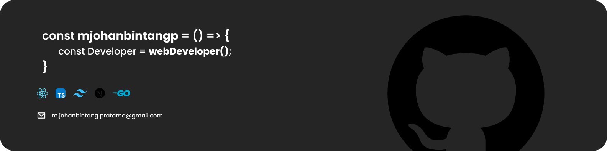

<h3 align="left">Hi, i'm mjohanbintangp, i'm a software engineer👋.</h3>

###

  

###

<h3 align="left">📖 About me</h3>

###

💻 I'm a Software Engineer 📚 Passionate about learning, clean code, and great user experience

###

<h3 align="left">🔥 Tech Stack</h3>

###

  
  
  
  
  
  
  
  
  
  
  
  
  

###

<h3 align="left">🛠️ Tools</h3>

###

  
  
  
  
  
  
  

###

<h3 align="left">🙋‍♂️ Let's connect with me</h3>

###

  
  
  

###

<h3 align="left">🚀 My contributions</h3>

###

###
